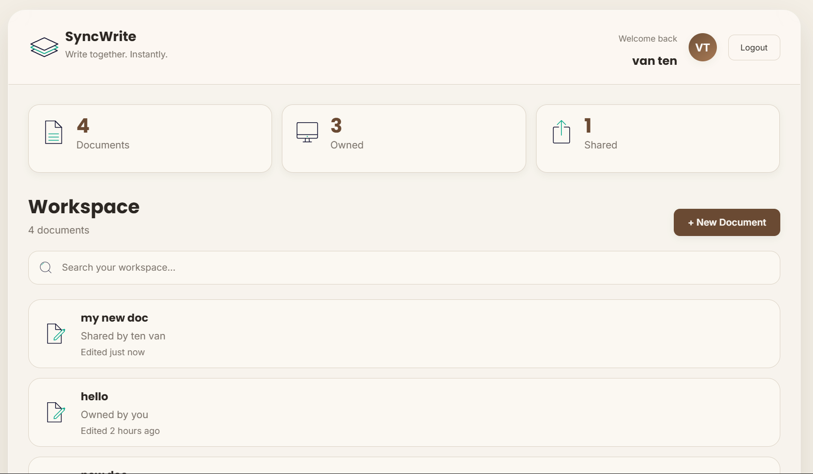
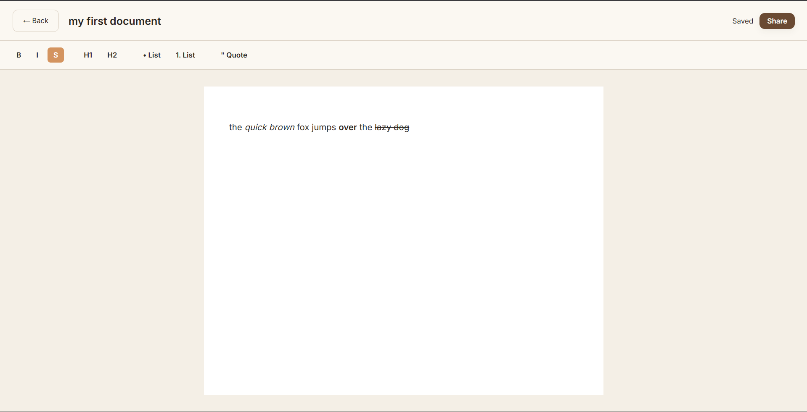
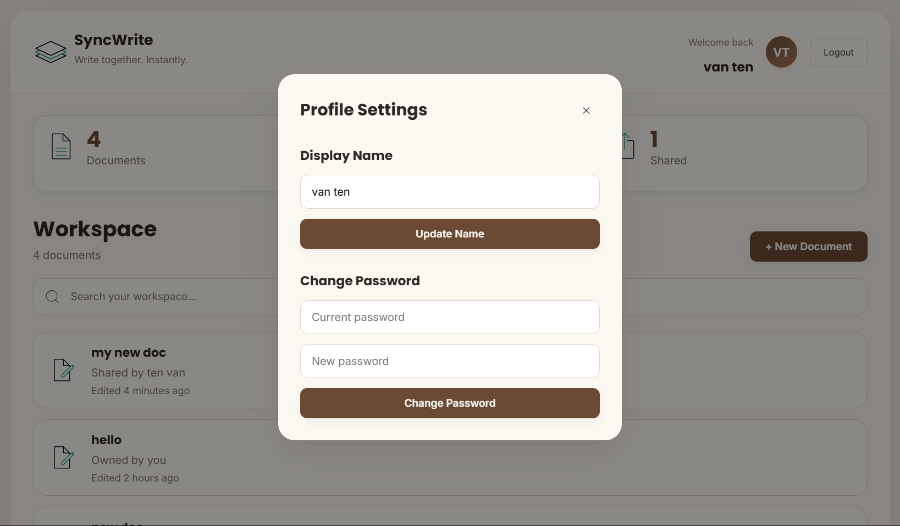
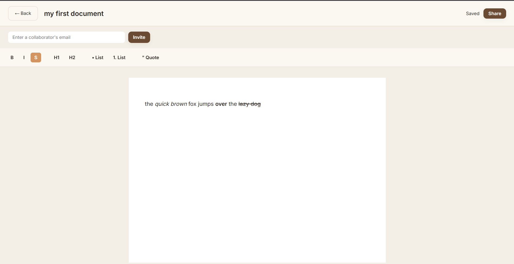
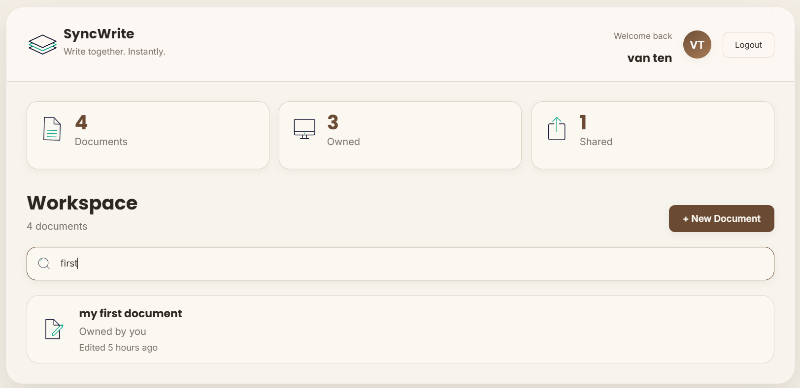
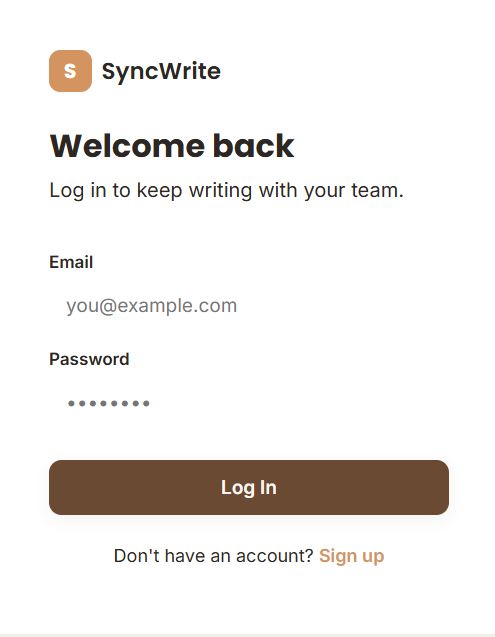
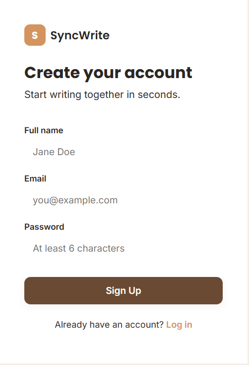
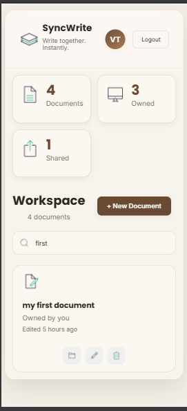

# SyncWrite

<p align="center">
  
</p>

<p align="center">


</p>

A full-stack **real-time collaborative document editor** built using **React, Node.js, Express, MongoDB Atlas, Socket.IO, and Tiptap**.

SyncWrite allows users to create, edit, and share rich-text documents while collaborating in real time. It includes secure authentication, document sharing, automatic saving, and a responsive interface designed for both desktop and mobile devices.

---

# Live Demo

### Frontend

https://syncwriteapp.vercel.app

### Backend

https://syncwrite-api.onrender.com

---

# Features

- Secure user authentication using JWT
- User registration and login
- Rich text editor powered by Tiptap
- Real-time collaboration using Socket.IO
- Automatic document saving
- Create, rename and delete documents
- Share documents with collaborators
- Protected routes and authorization
- Update profile information
- Change account password
- Responsive UI for desktop and mobile

---

# Tech Stack

## Frontend

- React
- React Router
- Axios
- Tiptap
- Socket.IO Client
- CSS

## Backend

- Node.js
- Express.js
- MongoDB Atlas
- Mongoose
- JWT Authentication
- bcryptjs
- Socket.IO

## Deployment

- Vercel
- Render
- MongoDB Atlas

---

# Screenshots

## Dashboard

<p align="center">

</p>

---

## Editor

<p align="center">

</p>

---

## Profile Settings

<p align="center">

</p>

---

## Share Document

<p align="center">

</p>

---

## Search

<p align="center">

</p>

---

## Authentication & Mobile

<table>
<tr>
<td align="center">

### Login



</td>

<td align="center">

### Register



</td>

<td align="center">

### Mobile



</td>
</tr>
</table>
---

# Project Structure

```text
SyncWrite
│
├── backend
│   ├── middleware
│   ├── models
│   ├── routes
│   ├── server.js
│   └── package.json
│
├── frontend
│   ├── public
│   ├── src
│   └── package.json
│
└── README.md
```

---

# Installation

## Clone Repository

```bash
git clone https://github.com/vansh-sundriyal/SyncWrite.git
```

---

## Backend

```bash
cd backend
npm install
npm run dev
```

---

## Frontend

```bash
cd frontend
npm install
npm run dev
```

---

# Environment Variables

## Backend (.env)

```env
MONGO_URI=your_mongodb_connection_string

JWT_SECRET=your_secret_key

CLIENT_URL=http://localhost:5173
```

---

## Frontend (.env)

```env
VITE_API_URL=http://localhost:5000/api

VITE_SOCKET_URL=http://localhost:5000
```

---

# REST API

| Method | Endpoint | Description |
|----------|-----------------------------|-------------------------|
| POST | `/api/auth/register` | Register a new user |
| POST | `/api/auth/login` | Login |
| PUT | `/api/auth/profile` | Update profile |
| PUT | `/api/auth/change-password` | Change password |
| GET | `/api/documents` | Get all documents |
| POST | `/api/documents` | Create document |
| GET | `/api/documents/:id` | Get document |
| PUT | `/api/documents/:id` | Rename document |
| POST | `/api/documents/:id/share` | Share document |
| DELETE | `/api/documents/:id` | Delete document |

---

# Socket Events

| Event | Description |
|---------|------------------------------|
| join-document | Join a document room |
| load-document | Load saved content |
| send-changes | Broadcast edits |
| receive-changes | Receive edits |
| save-document | Persist document |

---
